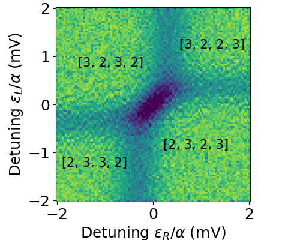

# QDATS
Efficient **Q**uantum **D**ot **A**rray **T**ransition **S**imulator. The transition finding in presence of finite tunnel couplings, non-constant charging energies and sensor dots

## Installation
The package supports Python 3.6 and later. To install the package, run the following command:
 

    pip install qdats

## Manuscript
The package is based on the manuscript by [Krause et al.](). "QDATS: Efficient Quantum Dot Array Transition Simulator; The transition finding in presence of finite tunnel couplings,
non-constant charging energies and sensor dots". The manuscript has been submitted to the SciPost Physics Codebases.

## Examples
The package provides a simple example to demonstrate the usage of the package. The example is available in the examples qatpack/examples folder. The example demonstrates the simulation of a quantum dot array with sensor dots, tunnel couplings, and non-constant charging energy. 

As a proof of principle, in the example we reconstruct the figure from the paper [Neyens et al.](https://journals.aps.org/prapplied/abstract/10.1103/PhysRevApplied.12.064049z), which shows the measured charge conductance signal from two sensor dots, detecting four-dot transition in the quantum dot array. The reconstructed figure is shown below.

  

## Files in this repository
    qdats
        |-- qdats
            |-- model.py
            |-- noise_processes.py
            |-- experiment.py
            |-- plotting.py
            |-- polytope.py 
            |-- simulator.py
            |-- tunneling_simulator.py
            |-- util_functions.py
        |-- examples
            |-- examples_scipost.ipynb # notebook to reproduce figures from paper
        |-- setup.py
        |-- README.md
        |-- LICENCE.md