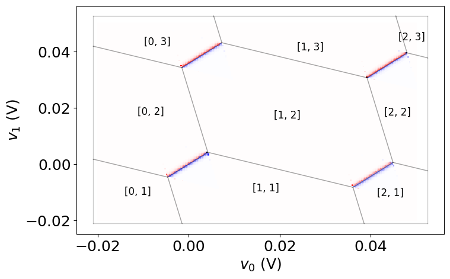

# Referee 1
*The work by Krzywda et al. presents a python package to simulate charge stability diagrams of capacitively- and tunnel-coupled quantum dot systems. The user can specify the parameters of the device (capacitance network parameters, noise characteristics of the sensing dot, etc.), and the code outputs the charge stability diagram.*

I know that these types of simulations are routinely done in many experimental and theoretical research groups worldwide (as well as the few companies building quantum hardware based on such devices) using in-house-built software solutions. Therefore I see the present package as a welcome attempt to provide a general tool for this community, which is likely to make research and engineering in the field more efficient.*

*The package has a number of functionalities that go beyond the minimal model of electrostatics with the constant-interaction model: e.g., gate virtualisation, charge-dependent capacitances, noise on the sensor dots, etc. Admittedly, there are also important functionalities that are often needed but missing from the present implementation: e.g., spin degree of freedom, orbital level spacing, role of the barrier gates, etc.*

*The authors benchmark their package against a selection of state-of-the-art experiments, which I find mostly satisfactory.*


### Issues to be adressed
1. *There is one point, however, where I am uncertain if the model used here is appropriate. This has to do with the simulation of the finite tunnel coupling effect, shown, e.g., in Fig. 8. My understanding is that in reality (more precisely, on the level of the Hubbard model), there is an even-odd effect for the tunnel-coupling-induced features of the charge stability diagram. For example, the tunnel coupling between the (1,0) and (0,1) charge configurations is weaker than the tunnel coupling between the (1,1) and (0,2) charge configurations by a factor of sqrt(2). In turn, this difference should be visible in any charge stability diagram that includes both transitions. However, the tunneling model specified by the authors, see Eq. (1), does not include this effect. My feeling is that this effect could be easily incorporated in the model, the only price to be payed is a slightly more elaborate formula instead of Eq. (1). I request the authors to implement this change, or if they decide not to do so, then at least comment on this issue in the revised version of the manuscript.
 (I do understand that this even-odd effect is related to the spin degree of freedom, which is admittedly missing from the current version of the package, but I also feel that this effect is qualitatively different from other spin effects, and also straightforward to implement in the existing framework. )*

**Response** 
We appreciate the suggestion. We have implemented this observation into the simulator and included it also in the manuscript. To be precise, when the number of electrons on the pair of dots affected by a transition is even, we increase the tunnel coupling by sqrt(2). We included the change in the manuscript

> In practice, the value of the effective tunnel coupling is influenced by the parity of the charges involved in the transition. Specifically, if the number of electrons on the pair of quantum dots affected by the transition is even, the tunnel coupling increases by a factor of \(\sqrt{2}\) \cite{vanVeenPRB2019}. While description of this effect would require considering the spin degree of freedom, it has been already implemented in the simulator due to its simplicity. This means that $t_{ij}$ in Eq. (1) is multiplied by \(\sqrt{2}\), if the number of electrons on the pair of dots is even, for instance $(2n-k,k) \to (2n-k-1,k+1)$.


1. *In the Conclusion, the authors list QDsim and SimCATS as software tools that are similar to QDarts. From the viewpoint of a potential user who wants to pick one of these potential solutions, I find it desirable to have a more detailed comparison of these tools, describing similarities and differences. Ideally, this could come in the form of a table comparing functionalities and performance, but if that is too much to ask for, then anything going beyond the current description would be welcome.*

**Response**
We agree with the reviewer that transparency in comparison between different packages is highly beneficial for the community and can possibly lead to their convergence into one fully-functional and widely used simulation package. Instead of table, which for continously evolving software might provide too restrictive information that quickly outdate itself, we have included additional description of each package, indcluding the forth one. We decided to hint at the philosophy against each of the packages and provide the most typical use cases. 

>Our work is complementary to three simultaneously published packages. To understand the mutual relationships between them, we will explain their main ideas and propose the most suitable use cases. 
The package QDsim , leverages a polytope-finding algorithm to efficiently simulate and locate charge transitions in large-scale quantum dot arrays. It is suitable for simulating the electrostatic global properties of large arrays (up to 100 dots), where the sensor signal and tunnel coupling effects are less relevant. It also includes a heuristic model capable of generating capacitance matrices for the defined geometry of gates, making it useful at the design stage
Similarly, the QArray package focuses on large devices and implements a standard constant interaction model. Crucially, it is characterized by high-performance computation achieved through its implementation in the Rust programming language and the specialized computing library JAX. As a result, this package is mostly suitable for data-driven applications, where a fast rate of data generation is more important than capturing detailed quantum effects
Finally, the SimCATS package provides a comprehensive tool for the complex analysis and design of qubit arrays. It includes tools for analyzing charge transitions, the influence of tunnel coupling, sensor signals, and it allows for implementing distortions that reflect experimental reality. It is suitable for simulating realistic charge stability diagrams that include sweeps of two voltage gates, where the polytope-finding algorithm and the identification of charge transitions for arbitrary voltage combinations are less relevant.
From this perspective, the QDarts package aims to deliver a solution that finds the middle ground between the faithful reconstruction of experimental reality and an easy-to-use, fast interface. As the name suggests, QDarts provides a convenient way of pinpointing specific charge states and selected transitions in arbitrary cuts through voltage space. It also extends the constant interaction model by adding realistic scaling behavior of the charging energies as a function of charge occupation. This makes QDarts a suitable package for autonomous simulations.
In conclusion, QDarts represents a significant advancement toward fast and reliable simulations of moderate-sized quantum dot arrays. Future versions of the package are planned to include spin degrees of freedom, barrier gates, and experimentally relevant effects such as latching and in-situ capacitance sensing.

(iii) *My final request is to add color scales and physical units to the conductance plots (Fig. 1, Fig. 7, Fig. 8). Perhaps one could trace these back from the example python notebooks; still I feel this is important, to make the paper self-contained and complying to the principles of accuracy and reproducibility.*
**Response** 

Appreciating the feedback, we have provided the colorbar in both the manuscript and the example file, including the colorscale in every figure where it applies. Due to the qualitative nature of the charge stability diagram and the complexity of the experimental setup, we decided to work with normalized conductance and capacitance values, i.e., values divided by the maximum value of the respective quantity. A similar strategy is often employed in the literature, even for experimental data, where either normalized conductance (D. Schröer et al, PRB 2007) or "a.u." units (N. W. Hendrix et al., Nature 2020) are used.


# Referee 2

*Krzydwa et al. present a physical model of the electrostatic of quantum dots which allows to extract the stable charge configuration of an array of quantum dot and simulate the response of the sensor to charge transition.
This work is very timely as we can see with few papers submitted at the same time on ArXiv which try to adress this need in the community with different approaches .
Moreover, the model is refined to account for the noise and the tunnel coupling and is tested against experimental data which are quantitatively reproduced.*

### Issues to be adressed
1. *The model is implemented in a python code which is accessible and properly documented. As experimentalists working on this problem, we found the code easy to use (while a bit difficult to install) and quite efficient in term of speed.
We have bench-marked this code against our own which has a more brute force approach and found the present code to be much more efficient in particular toward a large number of quantum dots and charge number. We would therefore encourage experimentalists to use this code to simulate their charge stability diagram of an open array.*

**Response** 
We appriciate the effort made by the reviewer to test the code and provide feedback. We are glad that the code was found to be efficient and easy to use. At the same time, we are grateful for the suggestion of improving the installation process.  

To improve user experience, we have developed transparent documentation and installation instructions, which is available at https://condensedai.github.io/QDarts/. We also provide requirements.txt file to install all necessary packages with one command. 


2. *There are still some functionalities that are missing and which could definitely benefit to the community to simulate more complex array. These are recommendations, and a bit beyond our expertise to estimate the technical feasibility.
First of all, the ability to work with a finite number of charge in the array would be very helpful to simulate isolated arrays which is a widely used approach in experiments (see Flentje, et al. Nat Commun. 8, 501 (2017) or Meyer et al. Nano Lett. 24, 11593 (2023) or Yang, et al. Nature 580, 350–354 (2020).)*

**Response** 


We appreciate the suggestion; however, the implementation is challenging in the presence of the sensor dot, which is a necessary element of our readout simulation. The sensor dot has to be connected to the reservoir, while, in principle, the other dots can indeed be decoupled. The presence of an alternative readout, such as in-situ reflectometry measurements from the next point, would allow for writing a wrapper around the CapacitanceModel class to limit the neighbor enumeration of a state. For example, one could call `CapacitanceModel.enumerate_neighbours` and then remove all returned states that do not conserve the total number of electrons. However, the full implementation of this solution or a partial reservoir connection requires significant effort, which is not aligned with other goals of the project.

In particular, a similar goal can be achieved by implementing transition dynamics into the array, based on barrier gates and tunnel coupling strength. While this approach allows for the implementation of effects like latching, setting the transition speed for certain reservoir transitions to zero can efficiently simulate the effect of fixed charges. We plan to implement this in a follow-up publication.

3. *Second, instead of using charge detection, probing the quantum capacitance through gate-based reflectometry would be a nice functionality. For instance, reproducing RF signal on stability diagrams for different parameters such as tunnel coupling, lever arm, frequency etc… would be extremely useful. This readout method is believed to be scalable approach to control and read spins in large array (Crippa, et al. Nat Commun 10, 2776 (2019), Veldhorst, et al. Nat Commun 8, 1766 (2017).)*

**Response** 
 
We are grateful for this suggestion. In order to make the code more versatile and useful for a wider range of applications, we have implemented the vannila version of in-situ reflectometry and provided its description in the repository, providing a separate example file. For the time being we have not included description of this mechanism in the manuscript, as the corresponding user interface is likely to change, once barrier gates are added (work in progress). Nevertheless, below we provide a brief description of the implemented feature from the corresponding notebook example ```insitu_reflectometry.ipynb```:

> Following Vigneau et al. (2023), we have implemented the adiabatic version of the quantum capacitance sensing. We use the fact that capacitance is proportional to $\partial P_\mathbf{n}/\partial \epsilon$, where $P_\mathbf{n}$ is the probability of finding charge occupation $\mathbf{n}$ that minimizes electrostatic energy $E_\mathbf{n}$ at given voltage $\mathbf{v}$, and $\epsilon_{\mathbf{n}\mathbf{m}}$ is the energy detuning to the next energy state with charge configuration $\mathbf{m}$. The insitu signal is activated by adding the insitu_axis argument (default: None):
```python

model = CapacitanceModel(
    ...
    insitu_axis=[1,0],
    plane_axes=[[1,0],[0,1]]
    ...
)
```
>where by defining the vector ```insitu_axis``` we select which gate is to be modulated. In the example above, the oscilattory signal is coupled to the first axis, which according to ```insitu_axis``` is corresponds to the first plunger gate $v_0$. We compute the relative signal strenght using finite difference approximation to the derrivative:
$$
S(\mathbf v) \propto  \frac{\partial P_\mathbf{n}}{\partial \epsilon_{\mathbf{n}\mathbf{m}}} \approx \frac{P_\mathbf{n}(\mathbf v + \delta \mathbf v) - P_\mathbf{n}(\mathbf v)}{\epsilon_{\mathbf{n}\mathbf{m}}(\mathbf{v} + \delta \mathbf v)- \epsilon_{\mathbf{n}\mathbf{m}}(\mathbf{v})}
$$
where $\delta \mathbf v = \delta v$ (```insitu_axis```$\cdot$ ```plane_axes```), $e\alpha$ is a constant irrelevant for normalized signal, and we keep $\delta v = 0.01$mV is sufficiently small and fixed. 

>To compute the signal $S(\mathbf{v})$ at every point in voltage space we contruct two-level Hamiltonian, using the subspace of two lowest lying energy states,
$$
H_{2\text{-level}}(\mathbf{v}) = \begin{pmatrix}
E(\mathbf{n},\mathbf{v}) & t_{\mathbf{n}\mathbf{m}}(\mathbf{v}) \\
t_{\mathbf{n}\mathbf{m}}(\mathbf{v}) & E(\mathbf{m},\mathbf{v})
\end{pmatrix}
$$
where $E(\mathbf{n},\mathbf{v})$ and $E(\mathbf{m},\mathbf{v})$ are the ground and excited state electrostatic energies corresponding to charge occupation $\mathbf{n}$ and $\mathbf{m}$, and $t_{\mathbf{n}\mathbf{m}}$ is the tunnel coupling between them, which is either constant or zero if two states are not coupled. Using the Hamiltonian one can compute relevant quantities, such as the energy detuning $\epsilon_{\mathbf{n}\mathbf{m}}(\mathbf{v})=E(\mathbf{n},\mathbf{v})-E(\mathbf{m},\mathbf{v})$ and the probability of being in on of the charge configurations 
$$
P_\mathbf{n}(\mathbf{v}) = \frac{1}{2} \left(1 - \frac{\epsilon_{\mathbf{n}\mathbf{m}}(\mathbf{v})}{\sqrt{\epsilon_{\mathbf{n}\mathbf{m}}(\mathbf{v})^2 + 4t_{\mathbf{n}\mathbf{m}}^2(\mathbf{v})}}\right)
$$
Intuitively we assume the signal is proportional to the change in quantum capacitance, caused by motion of the electron between the dots induced by the modulation of the gate voltages. At this point, we have not included the other effects contributing to in-situ signal including sisyphus resistance and tunneling capacitance, however their contribution is expected to be relatively weaker [Vigneau et al. (2023)].

Below we are attaching the signal produced by the current version of insitu reflectometry code, for the example of the two dots system:

